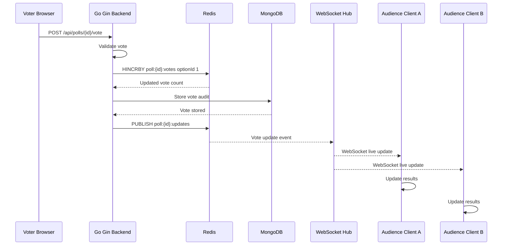

# 🗳️ Real-Time Live Polling Web Application

A production-style, low-latency live polling application built with **React**, **Go (Gin)**, **MongoDB**, **Redis (Pub/Sub & Atomic HINCRBY)**, and **WebSockets**.

---

## 1. Project Overview

The application empowers creators to formulate interactive polls with customized options, share unique public URLs, and collect votes from participants around the world. The standout feature is its **real-time synchronization**: as soon as any user submits a vote, all other connected screens reflect the updated totals and percentage progress bars without page refresh or HTTP polling.

---

## 2. Key Features

- **Authentication & Security:**
  - User registration and login with input sanitization and email validation.
  - Passwords hashed using `bcrypt` (never stored in plaintext).
  - Stateless JSON Web Token (`JWT`) authentication with expiration timestamps.
  - Route guards on poll creation, closing, and deletion.

- **Poll Creation & Management:**
  - Poll creator dashboard with status tracking (Active / Closed), total votes, and quick share links.
  - Backend validation: non-empty questions (5–300 chars), 2–10 options, duplicate option rejection.
  - Ability for poll creators to close or delete their polls at any time.

- **Presenter / Stage Mode (Full-Screen Projector Ready):**
  - Dedicated presentation route (`/poll/:pollId/present`) tailored for conferences, classrooms, and Zoom shares.
  - Large typography and high-contrast progress bars visible from across large rooms.
  - Native Fullscreen API integration ("Enter Fullscreen" / "Exit Fullscreen") with graceful iframe fallback.
  - Complete omission of administrative controls (no delete, edit, or dashboard controls on the stage).
  - Prominent QR code displayed alongside live vote tallies so audiences can scan and vote immediately.

- **QR Code Voting & Mobile Sharing:**
  - Auto-generated on every public poll page using dynamic origin (`window.location.origin + "/poll/" + pollId`).
  - High-resolution PNG QR download (`poll-{pollId}-qr.png`) for slides, flyers, or handouts.
  - "Copy Link" with instant visual confirmation (`✓ Link copied!`).
  - Native Web Share API integration (`navigator.share`) with automatic clipboard fallback.

- **Public Voting & Live Results:**
  - Shareable public poll URL (`/poll/:pollId`).
  - Single-click voting with immediate visual feedback and confetti celebration.
  - Real-time results page (`/polls/:pollId/results`) displaying live vote counts, winning options, and dynamic percentages.
  - Pulsing `● LIVE` WebSocket status badge.

- **Cross-Browser & Multi-Client Verification:**
  - In-app **Multi-Client Live Simulator** allowing simultaneous side-by-side verification of Chrome, Incognito, and simulated participant sessions.
  - Cross-tab / cross-window instant event dispatch.

---

## 3. Architecture & Data Flow



---

## 4. Tech Stack

| Layer | Technology | Purpose |
| :--- | :--- | :--- |
| **Frontend** | React 19, TypeScript, Tailwind CSS, Lucide Icons, Canvas Confetti | Responsive UI, live charts, client state |
| **Backend** | Go 1.23, Gin Web Framework | High-throughput, low-latency REST & WebSocket server |
| **Database** | MongoDB 7.0 | Persistent documents for users, polls, and audit vote logs |
| **Cache & Real-Time** | Redis 7.2 | Atomic counters (`HINCRBY`), Pub/Sub event broadcasting |
| **Transport** | WebSockets (gorilla/websocket) | Full-duplex live updates pushed to connected browsers |
| **Auth** | JWT (golang-jwt/v5) + bcrypt | Secure stateless authentication & password hashing |
| **Containerization** | Docker, Docker Compose, Nginx | Multi-service orchestration for local and cloud deployment |

---

## 5. Folder Structure

The repository maintains strict separation of concerns between frontend and backend:

```text
live-polling/
│
├── frontend/                     # React Single Page Application
│   ├── src/
│   │   ├── components/           # UI Modals, Navbar, MultiClientSimulator
│   │   ├── pages/                # PollVotePage, CreatePollPage, DashboardPage, PollsListPage
│   │   ├── services/             # ApiService (REST + WebSocket / Redis sync)
│   │   ├── hooks/                # usePollWebSocket real-time hook
│   │   ├── utils/                # Voter fingerprinting & session management
│   │   ├── types/                # TypeScript interfaces (Poll, Option, User, Results)
│   │   ├── App.tsx               # Main application routing and state container
│   │   └── main.tsx              # React entry point
│   ├── Dockerfile                # Production multi-stage Docker build with Nginx
│   ├── nginx.conf                # Nginx reverse proxy configuration for /api and /ws
│   ├── package.json              # Frontend dependencies
│   ├── tsconfig.json             # TypeScript configuration
│   └── vite.config.ts            # Vite build configuration
│
├── backend/                      # Go / Gin REST API & WebSocket server
│   ├── cmd/
│   │   └── server/main.go        # Server CLI entry point
│   ├── config/                   # Config loader, MongoDB & Redis connectors
│   ├── handlers/                 # HTTP Gin request handlers (Auth, Poll, WebSocket)
│   ├── middleware/               # JWT authentication middleware, CORS handling
│   ├── models/                   # Go struct definitions (User, Poll, Vote, Events)
│   ├── repository/               # Data-access layer interfacing MongoDB
│   ├── routes/                   # Gin route groupings and endpoint mappings
│   ├── services/                 # Business logic layer (Auth, Poll, Redis atomic service)
│   ├── utils/                    # Password hashing (bcrypt) and JWT generation
│   ├── websocket/                # WebSocket Hub, Client read/write pumps, Redis subscriber
│   ├── Dockerfile                # Lightweight Alpine Go container build
│   ├── go.mod                    # Go module definitions
│   ├── main.go                   # Main Go application entry point
│   └── main_test.go              # Complete unit and integration test suite
│
├── .env.example                  # Template for all environment variables
├── .gitignore                    # Excludes .env, node_modules, binaries
├── docker-compose.yml            # Multi-container orchestration (Mongo, Redis, API, UI)
└── README.md                     # Comprehensive documentation
```

### Clean Layering Pattern:

```text
HTTP Request
     ↓
  Handler (handlers/poll_handler.go)
     ↓
  Service (services/poll_service.go)
     ↓
  Repository (repository/poll_repository.go)
     ↓
  Database (MongoDB) / Cache (Redis HINCRBY)
```

---

## 6. Environment Variables

Copy `.env.example` to `.env` before running:

```bash
cp .env.example .env
```

| Variable | Description | Default |
| :--- | :--- | :--- |
| `PORT` | Go backend HTTP port | `8080` |
| `GIN_MODE` | Gin mode (`debug` or `release`) | `release` |
| `MONGODB_URI` | MongoDB connection URI | `mongodb://mongodb:27017` |
| `MONGO_DB_NAME` | MongoDB database name | `livepolling` |
| `REDIS_ADDR` | Redis host and port | `redis:6379` |
| `REDIS_PASSWORD` | Redis password (optional) | `""` |
| `JWT_SECRET` | Secret key used for signing JWT tokens | `super-secret-jwt-key` |
| `VITE_API_BASE_URL` | Frontend REST API base URL | `http://localhost:8080/api` |
| `VITE_WS_BASE_URL` | Frontend WebSocket base URL | `ws://localhost:8080/ws` |

---

## 7. Local Setup & Running

### Using Docker Compose (Recommended)

Run all 4 services (MongoDB, Redis, Go Backend, and React Frontend) with a single command:

```bash
docker-compose up --build
```

- **Frontend Application:** [http://localhost:3000](http://localhost:3000)
- **Go Backend API:** [http://localhost:8080](http://localhost:8080)
- **Health Check:** `curl http://localhost:8080/health`

### Running Backend Manually (Go)

```bash
cd backend
go mod download
go run main.go
```

### Running Frontend Manually (Node.js)

```bash
cd frontend
npm install
npm run dev
```

---

## 8. API Documentation

### Authentication Endpoints
- `POST /api/auth/signup` - Register a new user (`name`, `email`, `password`).
- `POST /api/auth/login` - Authenticate and obtain JWT (`email`, `password`).
- `GET /api/auth/me` - Retrieve current user profile (Requires `Authorization: Bearer <token>`).

### Poll Endpoints
- `GET /api/polls` - List all public active polls.
- `GET /api/polls/:id` - Retrieve poll details and option list.
- `GET /api/polls/:id/results` - Retrieve current vote tally and percentages.
- `POST /api/polls/:id/vote` - Cast a vote (`optionId`, `voterId`).
- `POST /api/polls` - Create a new poll (Protected, Requires JWT).
- `GET /api/polls/user/mine` - List polls created by current user (Protected, Requires JWT).
- `POST /api/polls/:id/close` - Close an active poll (Owner only, Requires JWT).
- `DELETE /api/polls/:id` - Permanently delete a poll (Owner only, Requires JWT).

### WebSocket Endpoint
- `WS /ws/polls/:id` - Full-duplex WebSocket connection to subscribe to real-time updates for poll `:id`.

---

## 9. Real-Time Architecture: How Redis + WebSockets Work

1. **Initial Hydration:**
   When a user navigates to `/poll/:pollId`, React issues a `GET /api/polls/:id/results` call to render the current snapshot immediately without waiting for events.
2. **WebSocket Registration:**
   The browser establishes a WebSocket connection to `/ws/polls/:id`. The Go backend adds the connection to a room mapping keyed by `pollId`.
3. **Atomic Increment in Redis:**
   When a vote arrives, the Go server executes:
   ```text
   HINCRBY poll:{pollId}:votes {optionId} 1
   ```
   This Redis operation is **O(1)** and **strictly atomic**, eliminating race conditions where concurrent votes could overwrite each other.
4. **Redis Pub/Sub Event:**
   Immediately following the increment, the Go backend publishes the event to Redis:
   ```text
   PUBLISH poll:{pollId}:updates {"pollId":"...","optionId":"...","count":42,"totalVotes":150}
   ```
5. **WebSocket Fan-out:**
   The Go Redis listener receives the Pub/Sub message and delivers the payload over the channels of all connected clients in that room.
6. **Zero-Polling UI Update:**
   React ingests the WebSocket message and smoothly updates the progress bars and total counters in-place.

---

## 10. Key Technical Decisions

### Why Redis?
Relational or document databases require read-modify-write locks or row-level write contention under heavy concurrent traffic. Redis provides in-memory atomic operations (`HINCRBY`) that complete in sub-millisecond time, plus built-in Pub/Sub for inter-process and multi-instance event routing.

### Why WebSockets instead of HTTP Polling or SSE?
HTTP polling generates wasteful server load and introduces polling intervals (latency). While Server-Sent Events (SSE) is unidirectional, WebSockets provide bi-directional framing and industry-standard integration with Go connection pools (`gorilla/websocket`).

### Why MongoDB?
MongoDB's schema flexibility allows storing polls with embedded arrays of options (`[]Option`) and audit vote logs (`VoteRecord`) without relational join overhead.

### How Concurrency is Handled?
No read-before-write logic is used for vote tallying. Votes are piped directly to Redis `HINCRBY`, which is executed atomically on Redis's single-threaded event loop.

### Duplicate Voting Policy:
- Each browser session generates a cryptographic UUID stored in client storage (`voterId`).
- The backend verifies if `HasUserVoted(pollId, voterId)` exists in the database.
- If already voted, the request is rejected with a `400 Bad Request` or `409 Conflict`.
- *Note:* In public anonymous polling, client fingerprints can be bypassed by clearing cookies or changing IPs; for strict enterprise verification, authenticated voting with user ID uniqueness is enforced.

---

## 11. Presenter Stage Mode & QR Voting Architecture

### Presenter Mode
The application provides a dedicated full-screen presentation mode designed for classrooms, conferences, meetings, and live events:
- **Dedicated Route:** `/poll/{pollId}/present`
- **Fullscreen API:** Native "Enter Fullscreen" / "Exit Fullscreen" controls via browser Fullscreen API with graceful fallback.
- **Zero Administrative Clutter:** Excludes delete, edit, auth controls, and debugging sidebars so only the poll question, results, and QR code are visible to the audience.
- **Distance Legibility:** High-contrast color palette, large font scale, and prominent progress bars optimized for 1080p, 1440p, and 4K displays.
- **Live Stream Integration:** Connects directly to `/ws/polls/:id` and updates in sub-100ms when any audience member votes.

### QR Code Voting
Every poll automatically generates an on-screen QR code:
- **Dynamic Routing:** Encodes `${window.location.origin}/poll/{pollId}`, pointing voters to the mobile-optimized voting page (never to the presenter screen).
- **Download High-Res PNG:** One-click download button renders a padded high-contrast PNG (`poll-{pollId}-qr.png`) suitable for conference slide decks.
- **Instant Sharing:** Native Web Share API (`navigator.share`) with automatic clipboard copy fallback.

---

## 12. End-to-End Verification Guide

### Test 1 — QR Generation & Scanning
1. Open any active poll (`/poll/:id`).
2. Verify the **"Scan to Vote"** card displays a clear, scannable QR code.
3. Scan using a phone camera to confirm it navigates directly to the voting page.
4. Click **"Download QR"** to confirm `poll-{pollId}-qr.png` downloads cleanly.

### Test 2 — Link Sharing
1. Click **"Copy Link"** on the poll or QR card.
2. Confirm the temporary `✓ Link copied!` confirmation appears and the URL is on your clipboard.
3. Test **"Share Poll"** to verify mobile share sheet invocation or clipboard fallback.

### Test 3 — Full-Screen Presenter Stage Mode
1. Click **"Presenter Mode"** from the poll page or creator dashboard.
2. Verify navigation to `/poll/:pollId/present`.
3. Click **"Enter Fullscreen"** to enter stage mode.
4. Confirm administrative controls (Edit, Delete, Auth) are omitted.
5. Confirm the QR code points to the public voting page `/poll/:pollId`.

### Test 4 — Real-Time Live Sync Across Devices
1. Open **Browser A** (or Stage Mode) on `/poll/:id/present`.
2. Open **Browser B** (or smartphone) on `/poll/:id`.
3. Submit a vote from Browser B.
4. Confirm Browser A updates vote count, percentages, and progress bars immediately without page reload or HTTP polling.

---

## 13. Automated Testing

Run the Go backend test suite covering signup, login, poll creation, validation, unauthorized access, and voting:

```bash
cd backend
go test -v ./...
```

Tests verify:
- ✅ Empty field and invalid email rejection during signup.
- ✅ Password verification and JWT issuance during login.
- ✅ Rejection of unauthorized poll creation without Bearer token.
- ✅ Validation: rejection of duplicate options and <2 options.
- ✅ Voting on valid options vs. non-existent options.
- ✅ Enforcement of duplicate voting policy.
- ✅ Access control ensuring only the poll owner can close or delete polls.

